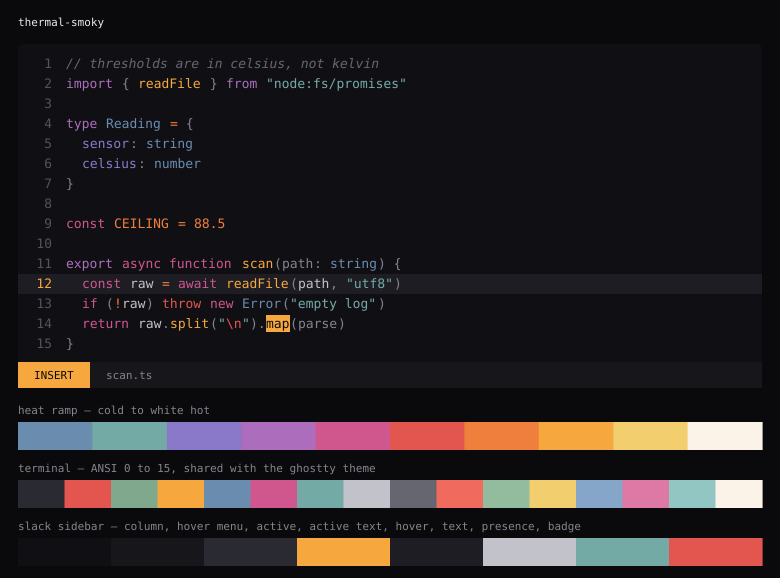
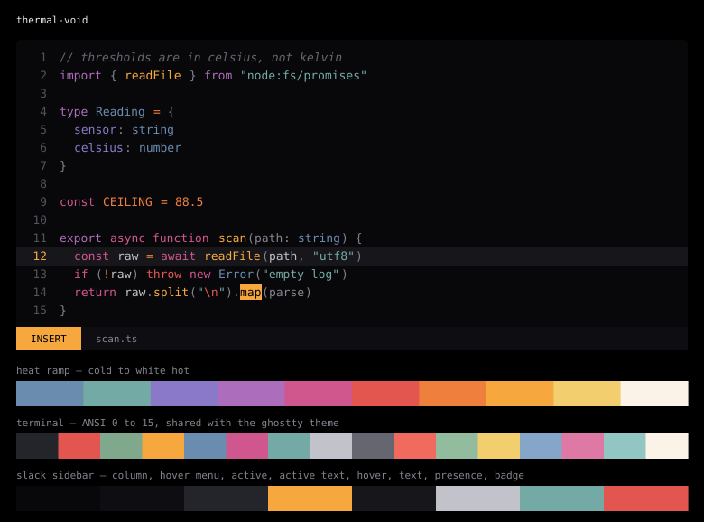
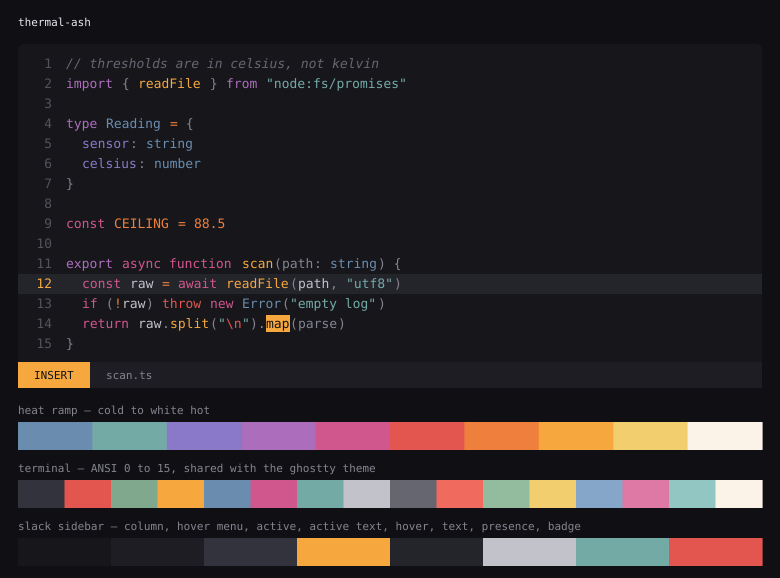

# thermal — previews

<!-- GENERATED by scripts/preview.lua -- do not edit -->

Rendered from `lua/thermal/palette.lua`, so these cannot drift from the theme.
Regenerate with `make preview`.

## thermal-smoky

Background `#101014` · body `#C2C2CB` · comments `#666671`

## thermal-void

Background `#08080A` · body `#C2C2CB` · comments `#666671`

## thermal-ash

Background `#16161B` · body `#C2C2CB` · comments `#666671`

